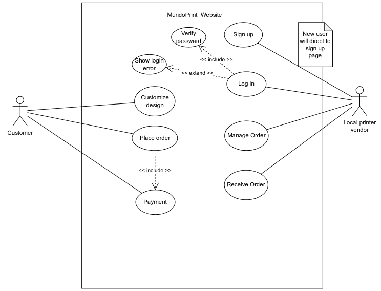
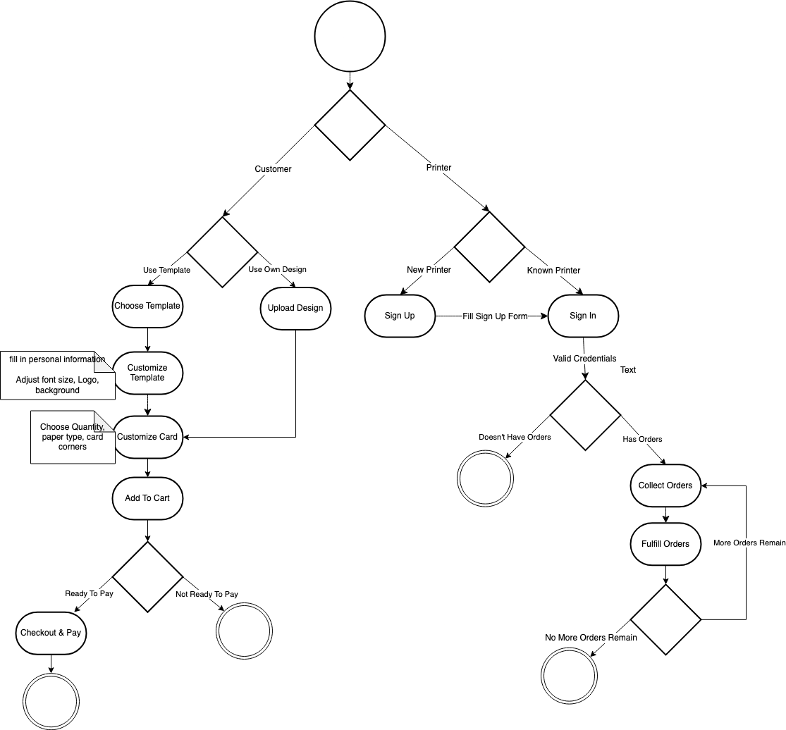

We are first designing the actual UI and customization features with all the possible detailing to make the implementation of the front end easier. We are also coming up with the flow charts and discussing on the architecture and the required technologies to implement the back-end.

## Use Cases

The main clients of the software are small businesses and local printers in emerging markets. We connect small businesses to the local printers that are partnered with our site, allowing for operation sustainability. We’re also lookingto implement a phone application version of the website for Android/iOS, making it easier and more accessible to small businesses. The payment method implementation allows on-demand business card printing.

### Actors

- **Customer**: A user who needs printing services and interacts with the website to create customized products, place an order, and pay for the order.

- **Local Printer Vendor**: A service provider who fulfills the printing orders placed by customers.
Use cases:

### Customer Use Case

- **Sign Up**: New vendors register on the website to create an account with username and password.
- **Log In**: Old vendors access their accounts to manage their activities on the website.
- **Verify Password**: Part of the login process, the system validates user credentials.
- **Show Login Error**: If the login attempt fails, the system displays an error message to the user.
- **Customize Design**: Customers choose a design template or upload their own and personalize it with details like name, company information, etc.
- **Place Order**: Once the design is customized, the customer proceeds to place the order for printing.
- **Payment**: The customer completes the transaction by paying for the services through a secure payment gateway.
- **Manage Order**: Local printer vendors access the system to manage and process the orders received.
- **Receive Order**: After an order is processed, the local printer vendor updates the system, marking the order as complete when it’s ready for delivery or pickup.

## Architecture

We chose MVC architecture because it made the most sense for this application. The website is a type of online shopping platform, so it would be useful to have this architecture. The model in this case is a database to store information about customers and printers, as well as inventory, and available designs. As for deployment, it will be hosted on WP.

The exact implementation of the architecture is managed by WP. We chose WP because it made the most sense to copy the existing website (for other printed products) [MundoPrints.in](https://www.mundoprints.in/), to [MundoCards.com](https://mundocards.wpcomstaging.com/) and change it to meet the requirements

## Technologies and Implementation Details

Since we are using WP most of the implementation will be inside WP and WP plugins. We are using the Elementor plugin to develop the front-end. Elementor is a drag and drop editor which makes it fairly easy to create a web UI. For managing products and customers we are using WC. For the design page we are using Zakeke which is a tailor made plugin for printing template customization. For the payment processing, we are using the RazorPay plugin for WP. For notifying customers for order confirmation and delivery, we are using Zoho Campaigns. For managing vendors and
implementing the vendor dashboard, we are using WC Vendors.

## User Interface

Drawing inspiration from the layout of MundoPrints.in, which is still in development, we meticulously refined the user interface to cater specifically to our product offerings. Given the diverse range of products such as logo tees, brochures, and more, we carefully pruned unnecessary UI elements and crafted a new menu bar.

Our revamped menu bar now boasts essential options such as 'Home', 'About Us', 'Contact', 'Privacy Policy', 'Vendor Login', and 'Cart', ensuring seamless navigation for our users. To accentuate the shopping experience, we strategically placed the cart logo adjacent to the menu bar, adding a visual cue for easy access.

In the product gallery, we sought to strike the perfect balance between aesthetics and functionality. Each product now features a concise description and clear price. Pixel-perfect adjustments ensure that the images are crisp and legible, elevating the overall visual appeal.To empower users with control over their browsing experience, we introduced 'Default Sorting' options and a button leading to a comprehensive product view. 

Harnessing the power of the 'Edit with Elementor' feature from WordPress, we seamlessly executed these enhancements, ensuring a user-centric design that is both elegant and intuitive.
